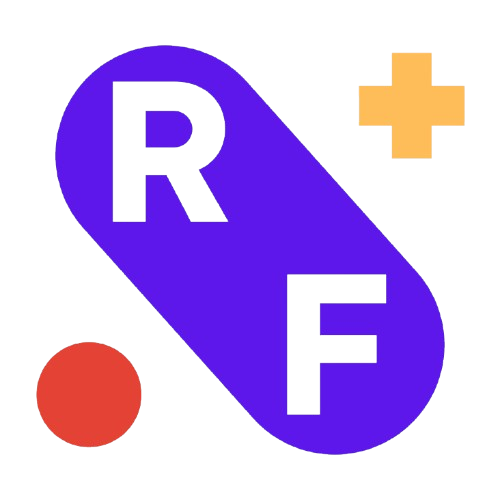
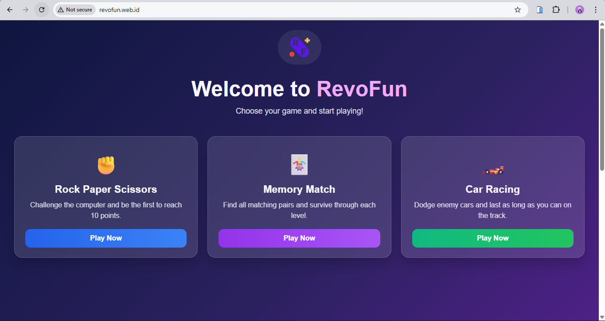
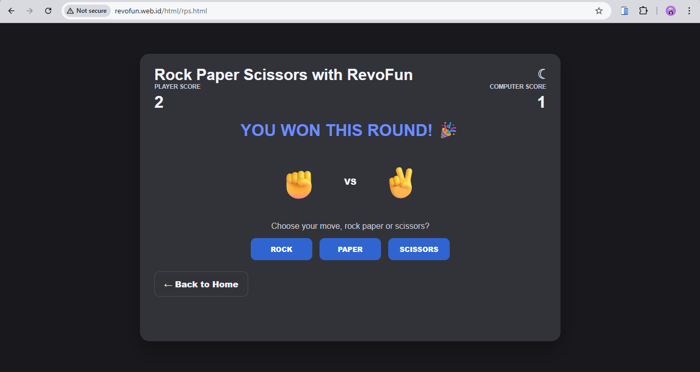
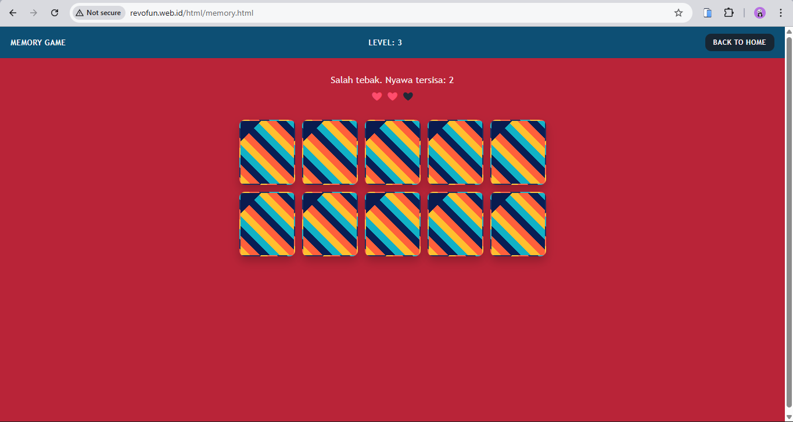
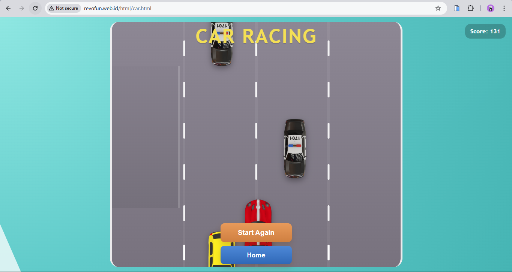

<p align="center">
  
</p>

<h1 align="center">🎮 RevoFun</h1>

<p align="center">
  Kumpulan mini game berbasis <b>HTML</b>, <b>CSS</b>, dan <b>JavaScript</b><br>
  dengan tampilan fun, ringan, dan siap dimainkan langsung di browser.
</p>

<p align="center">
  <a href="http://revofun.web.id/"><b>🌐 Live Demo</b></a>
</p>

---

## ✨ Tentang Project

**RevoFun** adalah website berisi beberapa game sederhana yang dibuat menggunakan **Vanilla JavaScript** tanpa framework tambahan. Project ini cocok untuk latihan front-end dasar, eksplorasi logika game, dan deployment ke **GitHub Pages**.

### Highlight utama

- 🎯 Terdiri dari **3 mini game interaktif**
- 🎨 UI arcade modern dan colorful
- ⚡ Ringan, cepat, dan mudah dijalankan
- 📁 Struktur project rapi dan beginner-friendly
- 🚀 Cocok untuk portfolio maupun latihan deployment

---

## 📸 Screenshot Project

| Home Overview                 | Game RPS Overview                            |
| ----------------------------- | -------------------------------------------- |
|  |  |

| Game Memory Overview                  | Game Car Overview                   |
| ------------------------------------- | ----------------------------------- |
|  |  |

---

## 🕹️ Daftar Game

### 1. Rock Paper Scissors

**File terkait:** `html/rps.html`, `css/rps.css`, `js/rps.js`

Fitur:

- Start screen dengan tampilan modern
- Sistem skor **first to 10**
- Hasil ronde tampil secara realtime
- Tombol **Start Again** untuk reset permainan

### 2. Memory Match

**File terkait:** `html/memory.html`, `css/memory.css`, `js/memory.js`

Fitur:

- Level bertahap dari **6 sampai 24 kartu**
- Preview kartu selama **3 detik** di awal level
- Sistem **3 nyawa**
- Progress game dan pesan kemenangan saat selesai

### 3. Car Racing

**File terkait:** `html/car.html`, `css/car.css`, `js/car.js`

Fitur:

- Player car dan enemy car berbasis asset gambar
- Kontrol **arrow key** dan dukungan sentuhan
- Kecepatan meningkat seiring skor bertambah
- Muncul status **game over** saat tabrakan

---

## 🛠️ Teknologi yang Digunakan

- **HTML5**
- **CSS3**
- **Vanilla JavaScript**

---

## 📁 Struktur Folder

```text
RevoFun2/
├── README.md
├── index.html
├── assets/
│   ├── RFlogo.png
│   ├── RF1.png
│   ├── RF2.png
│   ├── RF3.png
│   ├── RF4.png
│   └── cars/
│       ├── playercar.png
│       ├── enemycar1.png
│       ├── enemycar2.png
│       └── enemycar3.png
├── css/
│   ├── style.css
│   ├── rps.css
│   ├── memory.css
│   └── car.css
├── html/
│   ├── rps.html
│   ├── memory.html
│   └── car.html
└── js/
    ├── rps.js
    ├── memory.js
    └── car.js
```

> `index.html` berada di root project agar aman dan mudah saat di-deploy ke hosting statis.

---

## 🚀 Cara Menjalankan

### Opsi 1 — Langsung di browser

Buka file berikut:

```text
index.html
```

### Opsi 2 — Menggunakan Live Server

Jika memakai extension **Live Server** di VS Code, jalankan `index.html` agar navigasi antar halaman lebih nyaman saat testing.

---

## 🌐 Deploy ke GitHub Pages

Karena project ini bersifat statis, deploy dapat dilakukan dengan mudah melalui **GitHub Pages**:

1. Push project ke repository GitHub
2. Masuk ke **Settings** repository
3. Buka menu **Pages**
4. Pilih:
   - **Source:** `Deploy from a branch`
   - **Branch:** `main` atau `master`
   - **Folder:** `/ (root)`
5. Simpan dan tunggu hingga website aktif

### 🔗 Live Demo

- [http://revofun.web.id/](http://revofun.web.id/)

---

## 📌 Tujuan Pembuatan

Project ini dibuat untuk:

- latihan membangun website multi-page sederhana
- melatih logika interaktif dengan JavaScript murni
- membuat UI game yang menarik dan responsif
- menyiapkan project statis yang siap dipublikasikan

---

## © RevoFun

Made for fun, learning, and arcade-style experimentation.
